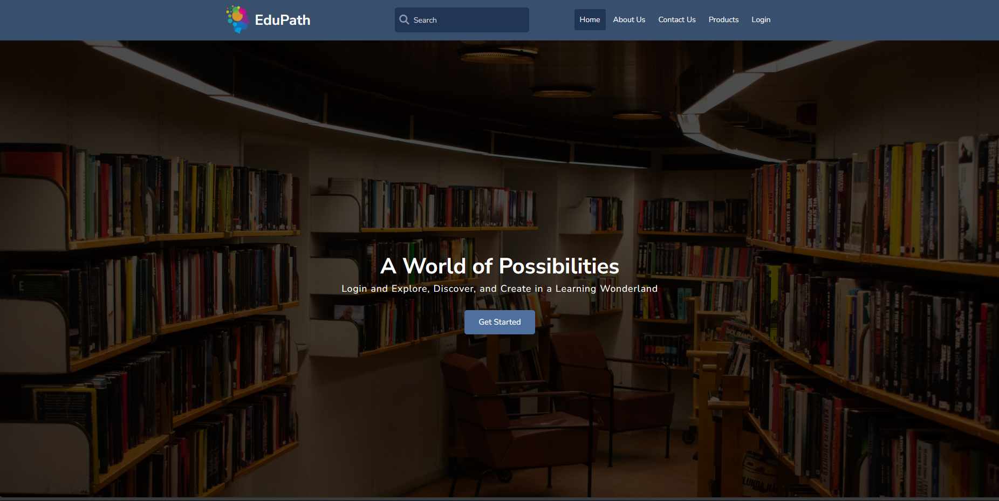

<div style="display:block; text-align:center">

# **Edupath**


</div>

## 📋 **Table of Contents**

- [**Edupath**](#edupath)
  - [📋 **Table of Contents**](#-table-of-contents)
  - [📖 **Introduction**](#-introduction)
  - [📑 **Task Objectives**](#-task-objectives)
  - [📌 **Our challenges**](#-our-challenges)
  - [👾 **Code Snippets**](#-code-snippets)
  - [📷 **Short Presentation of the Website**](#-short-presentation-of-the-website)
  - [👊 **Challenges**](#-challenges)
  - [🏗️ **Future Steps**](#️-future-steps)
  - [👨‍💻 **Our Team**](#-our-team)

## 📖 **Introduction**

EduPath starts as an **_assignment_** for us to to create a website for a **_fake company_**, that we called **Edupath**. The company is a fake company that provides online courses for students. The website is a platform for students to register and enroll in courses.

## 📑 **Task Objectives**

> 1. Create a **_website_** for a **_fake company_**
> 2. Create a **_website_** that is **_responsive_** for **_different screen sizes_**
> 3. Create at least **_3 pages_** for the website **_(Home, About, Contact)_**
> 4. Create at least **_1 section_** with **_4 columns_** on the **_Home page_** to test media queries

## 📌 **Our challenges**

> 1. **_Communication_** between teammates
> 2. **_Time management_**
> 3. Implementing **_new things_** to our design and code
> 4. Adapting **_media queries_** for different screen sizes
> 5. Using **_Git_** and **_GitHub_** for the first time

## 👾 **Code Snippets**

There is a lot of code in this project. So I will show you some of the code that we used in this project. I will show you the **_HTML_** and **_CSS_** code for the **_navigation bar_** and the **_hero-banner_** section of the website.

- ## **_HTML_** and **_CSS_** code for the **_navigation bar_** of the website

  One thing that was new to us and we implemented to the site was the dropdown menu. We used just **_HTML_** and **_CSS_** to create the dropdown menu. The code below is the **_HTML_** code for the dropdown menu.

  ```html
  <header>
    <div class="container container--flex">
      <a href="./index.html" class="logo container--flex">
        
        <h2>EduPath</h2>
      </a>
      <div class="nav-search container--flex">
        <form class="nav-form">
          <i class="fas fa-search"></i>
          <input type="text" placeholder="Search" class="form-control" />
        </form>
        <nav>
          <ul>
            <li><a href="./index.html" class="active">Home</a></li>
            <li><a href="./about-us.html">About Us</a></li>
            <li><a href="./contact-us.html">Contact Us</a></li>
            <li><a href="./products.html">Products</a></li>
            <li><a href="./login.html">Login</a></li>
          </ul>
        </nav>
        <div class="dropdown-container">
          <div class="menu-button">
            <svg
              xmlns="http://www.w3.org/2000/svg"
              width="32"
              height="32"
              viewBox="0 0 32 32"
            >
              <path
                fill="none"
                stroke="currentColor"
                stroke-linecap="round"
                stroke-linejoin="round"
                stroke-width="2"
                d="M4 8h24M4 16h24M4 24h24"
              />
            </svg>
          </div>
          <div class="dropdown">
            <ul>
              <li><a href="./index.html" class="active">Home</a></li>
              <li><a href="./about-us.html">About Us</a></li>
              <li><a href="./contact-us.html">Contact Us</a></li>
              <li><a href="./products.html">Products</a></li>
              <li><a href="./login.html">Login</a></li>
            </ul>
          </div>
        </div>
      </div>
    </div>
  </header>
  ```

  The dropdown menu is present in all pages and consist of a **_hamburger icon_** and a **_list of links_**. The **_hamburger icon_** is present on the **_mobile screen sizes_** and the **_list of links_** is present on the **_desktop screen sizes_**. The **_hamburger icon_** is a **_button_** that when clicked it will show the **_list of links_**. The **_list of links_** is a **_list_** of **_links_** that when clicked it will take the user to the page that the user wants to go.

  And here below is the **_CSS_** code for the dropdown menu.

  ```css
  header .dropdown-container {
    position: relative;
  }

  header a.active {
    background-color: var(--app-light-color-accent);
  }

  header .dropdown {
    position: absolute;
    top: 100%;
    background-color: #fff;
    box-shadow: rgba(149, 157, 165, 0.2) 0px 8px 24px;
    width: 200px;
    right: 0;
    border-radius: 4px;
    padding: 5px;
    translate: 0 8px;
    opacity: 0;
    visibility: hidden;
    pointer-events: none;
    transition: 300ms ease;
    z-index: 3;
  }

  header .dropdown a {
    display: block;
    color: var(--app-dark-background-color);
    font-size: 0.8rem;
    padding: 8px 10px;
    margin-top: 5px;
    border-radius: 4px;
    font-weight: 500;
    transition: 300ms ease-in-out;
  }

  header .dropdown a.active {
    color: var(--white);
  }

  header .dropdown-container .menu-button {
    background-color: transparent;
    border-radius: 50%;
    padding: 8px;
    cursor: pointer;
  }

  header .menu-button svg {
    --size: 1.4rem;
    height: var(--size);
    width: var(--size);
  }

  header .dropdown-container .menu-button:hover {
    background-color: var(--app-light-color-accent);
  }

  header .dropdown-container:hover .dropdown {
    translate: 0 0;
    opacity: 1;
    visibility: visible;
    pointer-events: auto;
  }

  header .dropdown a:hover {
    background-color: var(--app-dark-color-primary);
    color: var(--white);
  }
  ```

  And here is an image of the result of the codes above. The image below is the **_mobile screen size_**. When the screen size reach a certain value we change properties on the navigation bar to hide the **_list of links_** and show the **_hamburger icon_**. And when the **_hamburger icon_** is clicked it will show the **_list of links_**. The **_hamburger icon_** is a **_button_** that when clicked it will show the **_list of links_**.

  

- ## **_HTML_** and **_CSS_** code for the **_hero-banner_** section of the website

  This section of **_HTML_** is present in all pages of the website. This is the **_hero-banner_** section of the website. This section is the first thing that the user will see when they visit the website.

  ```html
  <section class="hero">
    <div class="bg-layer-image">
      
    </div>
    <div class="hero-content">
      <h1 class="title">A World of Possibilities</h1>
      <span>
        Login and Explore, Discover, and Create in a Learning Wonderland
      </span>
      <div class="links-container">
        <a href="./products.html" class="links">Get Started</a>
      </div>
    </div>
  </section>
  ```

  The image below represents the hero-banner section above. This image is responsive for different screen sizes. But we started with the **_desktop first approach_** for the **_media queries_** on this website. So we face a lot of challenges to make this section **_responsive_** on the **_mobile screen sizes_**.

  

  The **_CSS_** code below demonstrate the **_media queries_** for the website.The **_media queries_** in a simple way is the **_@media_** rule that is used to define different style rules for different media types/devices.

  ```css
  @media (max-width: 900px) {
    footer .container {
      justify-content: center;
    }
  }

  @media all and (min-width: 768px) {
    main.has-auth {
      display: grid;
      grid-template-columns: 1fr 1fr;
    }

    main aside {
      display: block;
    }

    .dropdown-container {
      display: none;
    }

    .contact-container {
      grid-template-columns: 0.8fr 1fr;
    }

    .grid-flow {
      grid-template-columns: 1fr 1fr;
    }

    section .hero-content {
      width: 50%;
    }

    section.about .grid-container {
      grid-template-columns: 1fr 1fr;
    }

    .team .title-container {
      width: 60%;
    }
  }

  @media all and (max-width: 768px) {
    .nav-search nav {
      display: none;
    }

    .about-us-section .about-image-container {
      order: 1;
    }

    .about-us-section .v-content {
      order: 2;
    }

    .grid-flow .about-image-container {
      aspect-ratio: 16/9;
    }
  }

  @media all and (min-width: 640px) {
    main.has-auth .container {
      width: 80%;
    }
  }

  @media all and (max-width: 640px) {
    main.has-auth .container {
      width: 80%;
    }

    header .nav-search {
      flex-grow: 0;
    }

    .product .product-container {
      width: 100%;
    }

    .product {
      flex-direction: column;
      align-items: center;
    }

    section.hero {
      height: 40dvh;
    }
  }

  @media all and (max-width: 501px) {
    .logo h2 {
      display: none;
    }

    .products-container {
      grid-template-columns: 1fr;
    }

    .product-img-container {
      width: 100%;
    }

    section.hero {
      height: 30dvh;
    }
  }

  @media all and (max-width: 400px) {
    footer .container {
      justify-content: center;
    }

    header .nav-form {
      display: none;
    }
  }
  ```

  As you see in the code above we use **_min-width_** and **_max-width_** to make the website **_responsive_** for different screen sizes and as the screen size gets smaller the **_CSS_** code gets more specific to make the sections **_responsive_** for the screen size.

  If you start for the **_mobile first approach_** you will see that the **_CSS_** code will be more simple and you will have less code to make the website **_responsive_** for different screen sizes. But we started with the **_desktop first approach_** and we had to make a lot of changes to make the website **_responsive_** for different screen sizes.

  I suggest you guys these links to learn more about **_media queries_**:

  - [A Complete Guide to CSS Media Queries](https://css-tricks.com/a-complete-guide-to-css-media-queries/)
  - [Using media queries](https://developer.mozilla.org/en-US/docs/Web/CSS/CSS_media_queries/Using_media_queries)

## 📷 **Short Presentation of the Website**

Here is a short video presenting the website.We have to consider the **_consistency_** and right use of **_colors_**, so we opted for a simple design using a few colors and a simple layout.

Fell free to explore the website and give us some feedback.

<video src="./assets/img/20231014-2058-21.0740414.mp4" controls title="Title"></video>

## 👊 **Challenges**

As I mentioned our challenges were **_communication_** between teammates, **_time management_**, implementing **_new things_** to our design and code, adapting **_media queries_** for different screen sizes and using **_Git_** and **_GitHub_** for the first time.

And the most challenge one was **_Git_** and **_GitHub_**. At the beginning of the project we had a lot of challenges with them. We had problems with **_merge conflicts_** and **_pull requests_** So we grab videos from **_YouTube_** to learn how to work with **_Git_** and **_GitHub_**.

- [Git & GitHub Crash Course For Beginners](https://www.youtube.com/watch?v=SWYqp7iY_Tc)

- [Git & GitHub Tutorial for Beginners](https://www.youtube.com/watch?v=8Dd7KRpKeaE&t=1s&ab_channel=CoderCoder)

## 🏗️ **Future Steps**

And here are some of the future steps for this project.

- [ ] Add a platform for teachers to create courses and manage their courses.
- [ ] Make possible website management for the admin.
- [ ] Add more features for the students.
- [ ] Add additional features with **_JavaScript_**.

## 👨‍💻 **Our Team**

Authors of this project:

- [Marcelo Lopes Fernandes](https://github.com/marcelolop)
- [Stefano Turcarelli](https://github.com/stefanoturcarelli)
- [Richard](https://github.com/TheNiyiRichard)

  Readme created by [Marcelo Lopes Fernandes](https://github.com/marcelolop)
